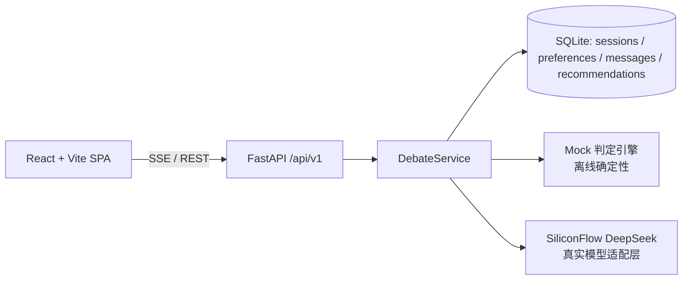

# 🍜 FoodArena AI · 校园干饭辩论赛

> 基于敏捷方法的 AI 原生选餐决策应用：两个 AI 大厨（**川辣派** vs **粤式养生派**）
> 围绕你的口味、预算、天气与同行人数进行最多 3 轮辩论，最终由裁决器出具一份可解释的
> **干饭战报**——菜品、理由、置信度与四维评分。


---

## 目录

1. [产品定位与 MVP](#产品定位与-mvp)
2. [系统架构](#系统架构)
3. [技术栈](#技术栈)
4. [快速启动（5 分钟跑通演示）](#快速启动5-分钟跑通演示)
5. [使用真实模型（可选）](#使用真实模型可选)
6. [环境变量](#环境变量)
7. [API 一览](#api-一览)
8. [测试与质量门禁](#测试与质量门禁)
9. [Docker 运行](#docker-运行)
10. [演示与答辩](#演示与答辩)
11. [团队与敏捷过程](#团队与敏捷过程)
12. [已知限制与扩展方向](#已知限制与扩展方向)
13. [许可](#许可)

---

## 产品定位与 MVP

面向“今天吃什么”这一校园高频决策难题，用**透明、对抗、可解释**的 Multi-Agent
流程取代黑盒推荐：不是只给你一个结果，而是让你**看见两位大厨如何为自己的一方
菜品辩护**，再读到一份有依据的战报。

**MVP（Sprint 1–2 已完成）**
- 输入偏好（口味 / 预算 / 天气 / 同行人数）并创建可追踪会话；
- 川辣派与粤式养生派严格交替发言；默认最多 3 轮，满足收敛条件时可提前结束；
- 裁决器出具战报：`dish` + `reason` + `confidence` + 四维 `score_breakdown`
  （口味 / 预算 / 天气 / 辩论表现）；
- 会话状态机 `PENDING → RUNNING → VALIDATING → SUCCESS / FAILED`，全程持久化到 SQLite。

**Sprint 3–4 已增强**
- SSE 实时流式辩论与断线恢复；防御性编程（超时重试 / 输入校验 / Prompt 注入防护 /
  脱敏日志）；22 条评测集；Docker 容器化与 GitHub Actions 全量流水线。

---

## 系统架构



两种**模型提供方**切换自如（`FOODARENA_PROVIDER`）：

| 提供方 | 说明 | 网络 | API Key |
| --- | --- | --- | --- |
| `mock`（默认） | 用合成菜品菜单 + 规则引擎做确定性评分与战报 | 无 | 不需要 |
| `real` | 经 SiliconFlow 调用 DeepSeek，人格化辩论 + 结构化裁决 | 需要 | 需要 |

> 六图体系（用例图 / DFD / 领域类图 / ER / 时序图 / 状态机）见
> [docs/system_design.md](docs/system_design.md)。

---

## 技术栈

- **后端**：Python 3.11+ · FastAPI · SQLAlchemy 2 · SQLite · Pydantic v2 · httpx
- **AI 服务**：SiliconFlow（DeepSeek-V4-Flash），OpenAI 兼容
- **前端**：React 18 · Vite 5 · TypeScript · Vitest / Testing Library
- **质量**：pytest · pytest-bdd（Gherkin）· ruff · ESLint
- **交付**：GitHub Actions · Docker / docker-compose

---

## 快速启动（5 分钟跑通演示）

### 方式 A：本地一键（推荐演示）

需要 Python ≥ 3.11 与 Node ≥ 18。

**1. 后端**

```powershell
python -m venv .venv
.\.venv\Scripts\Activate.ps1
python -m pip install -e ".[dev]"
foodarena-api        # 默认 http://127.0.0.1:8000
```

**2. 前端**（另开终端）

```powershell
cd frontend
npm install
npm run dev           # 默认 http://127.0.0.1:5173 （已代理 /api → :8000）
```

打开 http://127.0.0.1:5173 → 填口味「麻辣」→ 开始辩论 → 看 6 条消息 →
跳转战报。默认 `mock` 提供方，无需任何 API Key。

### 方式 B：仅后端 + Mock 冒烟

```powershell
curl -X POST http://127.0.0.1:8000/api/v1/sessions ^
  -H "Content-Type: application/json" ^
  -d "{\"taste\":\"麻辣\",\"budget_yuan\":15,\"weather\":\"rainy\",\"companions\":2}"
# → 201 {"session_id": "...", "status": "PENDING"}
```

---

## 使用真实模型（可选）

把 `.env.example` 复制为 `.env` 并填入 SiliconFlow Key，然后：

```powershell
Copy-Item .env.example .env   # 编辑 SILICONFLOW_API_KEY
$env:FOODARENA_PROVIDER = "real"
foodarena-api
```

前端无需改动。真实模式下辩论由 DeepSeek 人格化完成，结构化 JSON 回复经
Pydantic 校验；超时 / 429 / 5xx 自动指数退避重试。**没有可用 Key 时演示完全
正常**——这是设计目标。

---

## 环境变量

见 [.env.example](.env.example)。全部列于下：

| 变量 | 默认 | 说明 |
| --- | --- | --- |
| `SILICONFLOW_BASE_URL` | `https://api.siliconflow.cn/v1` | 硅基流动 Base URL |
| `SILICONFLOW_MODEL` | `deepseek-ai/DeepSeek-V4-Flash` | 模型标识 |
| `SILICONFLOW_API_KEY` | — | **勿提交**；缺失时仅影响 `real` 提供方 |
| `FOODARENA_PROVIDER` | `mock` | 辩论提供方 `mock` / `real` |
| `FOODARENA_DATABASE_URL` | `sqlite:///./foodarena.db` | 持久化位置 |
| `FOODARENA_PORT` | `8000` | API 端口 |
| `FOODARENA_STATIC_DIR` | — | 设置后 API 直接托管前端 dist |
| `VITE_API_BASE_URL` | 同源 | 前端访问后端的完整 URL |

---

## API 一览

| 方法 | 路径 | 说明 |
| --- | --- | --- |
| `POST` | `/api/v1/sessions` | 创建会话 → `201` + `session_id`（非法偏好 → `422`） |
| `POST` | `/api/v1/sessions/{id}/debate` | 运行/续跑辩论，幂等返回当前状态 |
| `GET` | `/api/v1/sessions/{id}` | 会话状态 + 消息 + 战报（有则） |
| `GET` | `/api/v1/sessions/{id}/events` | **SSE** 流：`status`/`round_started`/`message`/`report`/`done` |
| `GET` | `/api/v1/sessions/{id}/report` | 仅 `SUCCESS` 返回战报，否则 `409` |
| `GET` | `/healthz` | 健康检查 |

交互式文档：启动后访问 http://127.0.0.1:8000/docs。

---

## 测试与质量门禁

```powershell
# 后端：单元 + 契约 + 安全 + 韧性
pytest
# BDD（Gherkin，US01/02/03）
pytest tests/features
# 22 条评测集评分（mock 提供方，离线）
python eval/score_evalset.py

# 静态质量
ruff check . && ruff format --check .

# 前端
cd frontend
npm run lint && npm run typecheck && npm run test && npm run build
```

当前基线（2026-10-07 本地复核）：**98 个后端测试通过；BDD 场景包含在测试集内；评测集 22/22（100%）**。
CI（`.github/workflows/ci.yml`）在 Push/PR 自动执行以上全部门禁。

---

## Docker 运行

```bash
docker compose up --build
# 前端 http://localhost:3000 → 自动代理 /api 到后端
# 后端健康检查 http://localhost:8000/healthz
```

- 后端镜像非 root 运行 + `HEALTHCHECK`（[Dockerfile](Dockerfile)）；
- SQLite 数据持久化在命名卷 `foodarena-data`；
- `docker-compose.yml` 支持 `FOODARENA_PROVIDER` / `SILICONFLOW_API_KEY` 透传；
- 仅前端镜像（`frontend/Dockerfile` + nginx）用于本地预览。

---

## 演示与答辩

一份可复现的 3 分钟演示路径（无需真实数据 / 真实 Key）：

1. 打开首页，输入：口味**清淡** · 预算 **12 元** · 天气**热** · 同行 **1 人**；
2. 观看川辣派与粤式养生派最多 3 轮交替发言（SSE 实时，含证据佐证）；
3. 辩论成功后点击“查看完整战报与评分”，查看推荐菜品、理由、置信度和四维评分；
4. （可选）刷新页面 / 断开重连，会话从存储恢复，不重复辩论。

---

## 团队与敏捷过程

Issue 标题按 **4 个 Sprint** 分类，提交历史包含 PR 合并和 Angular 风格前缀；仅凭这些记录不能确认实际时间盒和每次审查过程。以下分工依据公开 GitHub
记录整理；Issue 未设置 Assignee，因此不把 Issue 创建者直接视为开发负责人。

| 账号 / 工具 | 可核验贡献 | 依据 |
| --- | --- | --- |
| `wujiade-2005` | 仓库初始化、Sprint Issue 规划、PR 集成与仓库维护 | 初始提交、26 个 Issue 创建记录、PR #27/#29 合并提交 |
| `Lnxy-0` | SiliconFlow 接入、轮次控制、FastAPI/SQLite、React/SSE、测试评测、Docker/CI、文档与缺陷修复 | 13 个可见提交；PR #27/#29 已合并，PR #28 尚未合并 |
| Claude Haiku 4.5 | 多次提交的 Co-authored-by 元数据署名；不能据此确认实际调用或审阅过程 | Git 提交元数据 |

完整过程材料：

- 系统三大模型六图：[docs/system_design.md](docs/system_design.md)
- 核心 User Story 规约：[docs/user_stories/](docs/user_stories/)
- Sprint 复盘：[Sprint 1](docs/sprint1_report.md) · [Sprint 2](docs/sprint2_report.md) · [Sprint 3](docs/sprint3_report.md) · [Sprint 4](docs/sprint4_report.md)

- 仓库约定与 AI 协作规则：[AGENTS.md](AGENTS.md)
- Issue / PR 模板：`.github/ISSUE_TEMPLATE/` · `.github/PULL_REQUEST_TEMPLATE.md`
- 提交规范：`feat:` / `fix:` / `test:` / `docs:` / `chore:`

---

## 已知限制与扩展方向

**当前限制（如实声明，未夸大）**
- 数据为**合成菜品菜单**，非真实食堂/外卖菜单；不含任何真实学生隐私；
- `real` 提供方依赖网络与 SiliconFlow 额度；评审演示默认走 `mock`；
- 单进程单 SQLite：适合课程演示与单用户，不做高并发扩展。

**Roadmap（后续 Backlog）**
- 接入真实食堂/外卖菜单与开放菜价；
- 增加 `FAILED` 会话的真正重试接口，并使前端重试文案与行为一致；
- 评测集纳入真实模型回归基线。

---

## 许可

[MIT](LICENSE)
