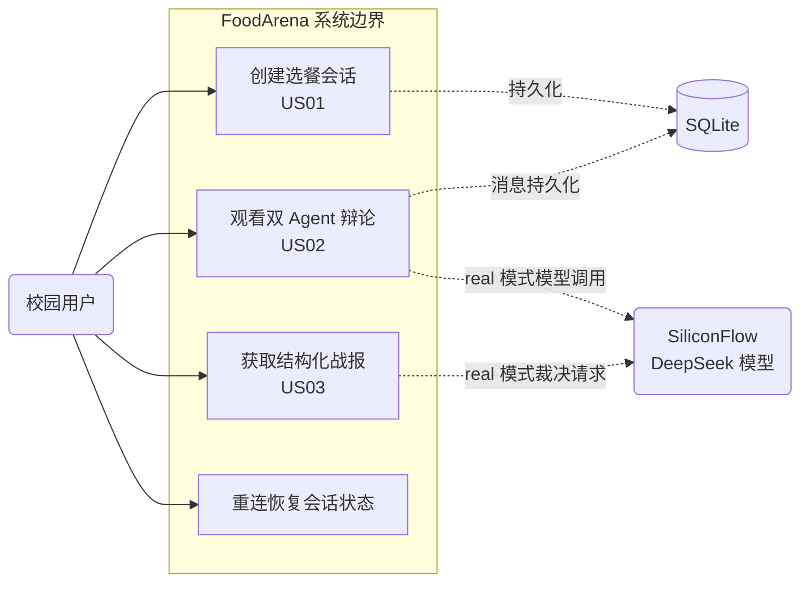
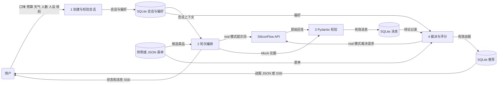
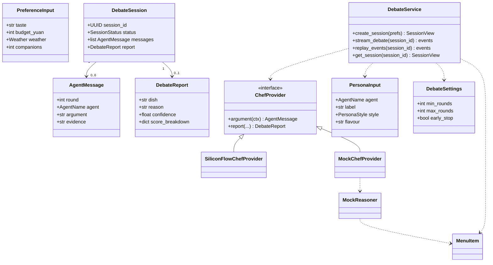
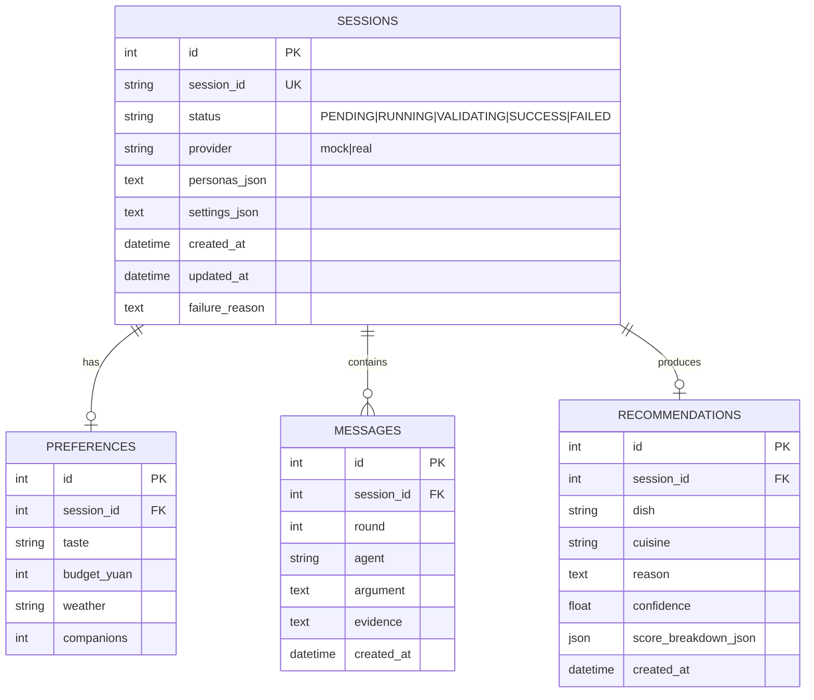
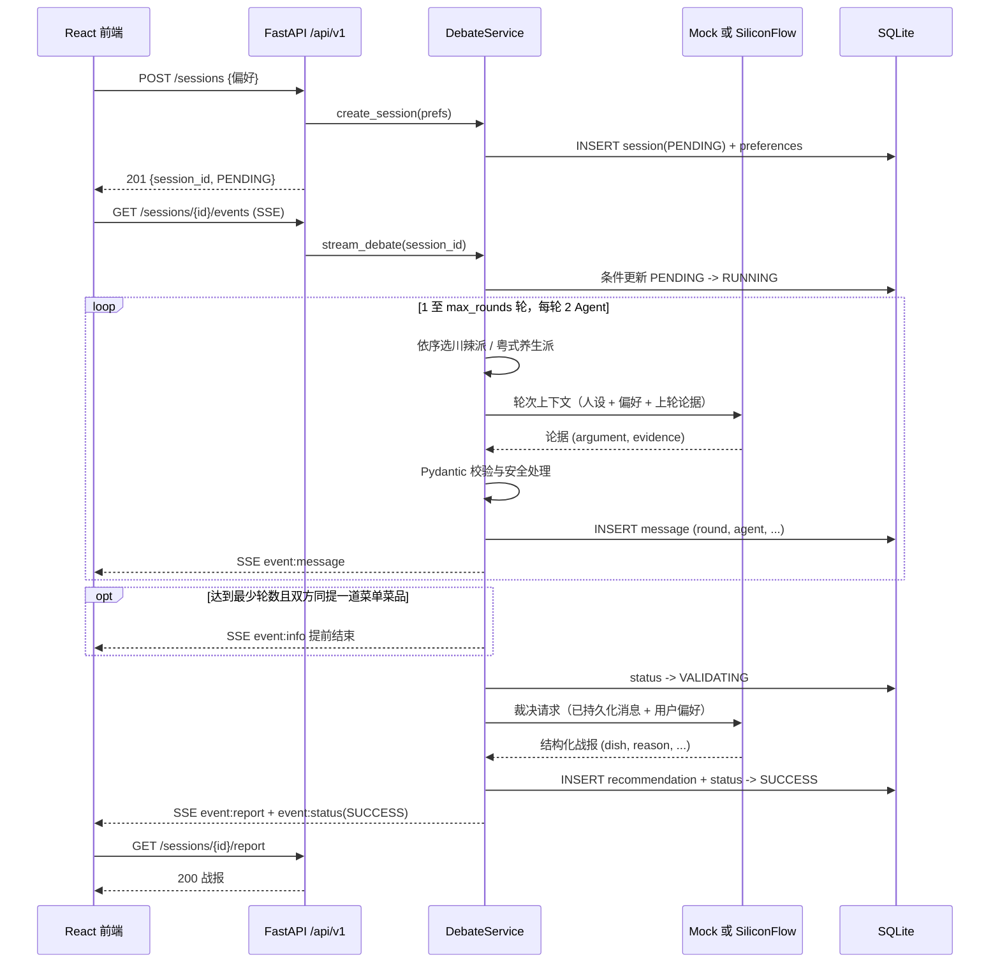
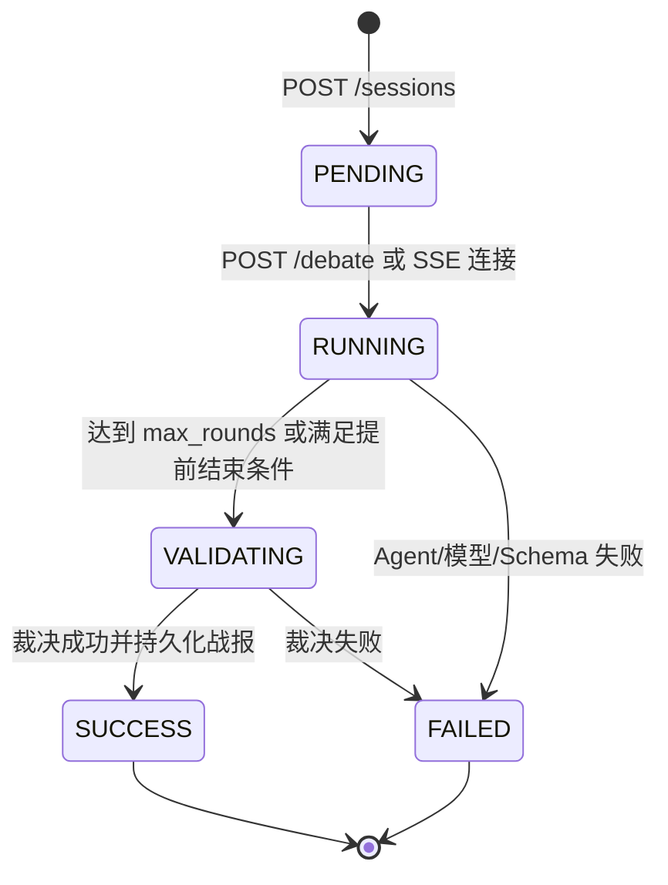

# FoodArena AI — 系统设计规约（三大模型 · 六图体系）

> 校园干饭辩论赛与美食擂台：基于敏捷方法的 AI 原生选餐决策应用。
> 基于 `main` 提交 `496eb9d82c`（2026-09-11）校核，图用 Mermaid 编写，可直接在 GitHub 渲染。
> 本文以代码现状为准：默认最多三轮六条消息；若配置提前结束，实际可为一至三轮、两至六条消息。

- 图 1 系统顶层用例图（功能模型）
- 图 2 系统数据流图 DFD（功能模型）
- 图 3 系统领域类图（数据模型）
- 图 4 数据库实体关系图 ER（数据模型）
- 图 5 端到端核心时序图（动态模型）
- 图 6 会话生命周期状态机图（动态模型）

系统边界：React/Vite 单页应用经 REST/SSE 调用 FastAPI；`DebateService` 组织 Mock 或 SiliconFlow 提供方，SQLAlchemy 将四类业务记录持久化到 SQLite。菜单是运行时校验的 JSON 或内置样例，并非数据库表。外部模型输出须经 Pydantic 校验后落库。`FAILED` 当前是终态，用户须创建新会话才能再试。

---

## 图 1 · 系统顶层用例图

---

## 图 2 · 系统数据流图（DFD）

---

## 图 3 · 系统领域类图

---

## 图 4 · 数据库实体关系图（ER）

约束：`preferences.session_id` 唯一（每个会话一份偏好）；`recommendations.session_id` 唯一（最终战报仅一份）；`messages` 按 `id` 排序即发言顺序。`personas_json` 和 `settings_json` 记录可选自定义配置；`MenuCatalog` 不是数据库实体。

---

## 图 5 · 端到端核心时序图

---

## 图 6 · 会话生命周期状态机图

补充说明

- 只有 `PENDING` 允许启动辩论；重复启动/已完成会话再次调用返回当前状态，
  按 PENDING 条件认领设计，不应产生第二条执行链（图 5 中 `stream_debate` 的幂等语义）。
- `FAILED` 会话永不返回伪造的成功战报：`GET /report` 仅对 `SUCCESS` 开放，
  否则返回 `409`。
- 当前前端失败页“重试”只是刷新页面；后端会重放 `FAILED` 状态，不能将同一会话重新置为 `RUNNING`。需新建会话，或另行设计重试接口。该文案与行为不一致，列为后续改进。
- API 另提供 `GET /api/v1/menu`；菜单由 `menu_store.py` 装载并经 `MenuCatalog` 校验。`real` 模式依赖外部网络及密钥，默认 `mock` 模式可离线演示。

## 实现可追溯性

| 设计点 | 代码与验收依据 |
| --- | --- |
| 输入、配置、输出契约 | `src/foodarena_ai/domain.py`；`tests/test_domain_contracts.py` |
| 状态认领、轮次、提前结束、事件重放 | `src/foodarena_ai/service.py`；`tests/test_service.py` |
| 四表与唯一约束 | `src/foodarena_ai/db.py` |
| REST/SSE 与错误状态 | `src/foodarena_ai/main.py`；`tests/test_api.py` |
| US01–US03 基础 BDD | `tests/features/` |

基线：[GitHub 仓库 `496eb9d82c`](https://github.com/wujiade-2005/foodarena-ai/tree/496eb9d82c)。图为实现抽象；类图中的 `DebateSession` 表示领域会话概念，在代码中由 `SessionView`/`SessionRow` 分别承担对外契约和持久化职责。

## 推导边界

六图是当前源码的静态抽象，不是原始设计会议记录，也不证明部署、性能或运行成功。每项结论应返回上述固定基线源码核对；测试文件只表明存在断言，测试是否通过须查看独立执行结果。用户故事、Sprint 报告和本文均为新增分析，不能互作事实证据。
