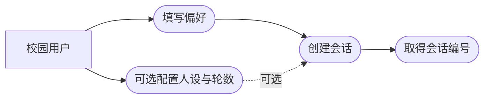
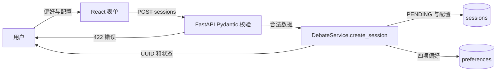
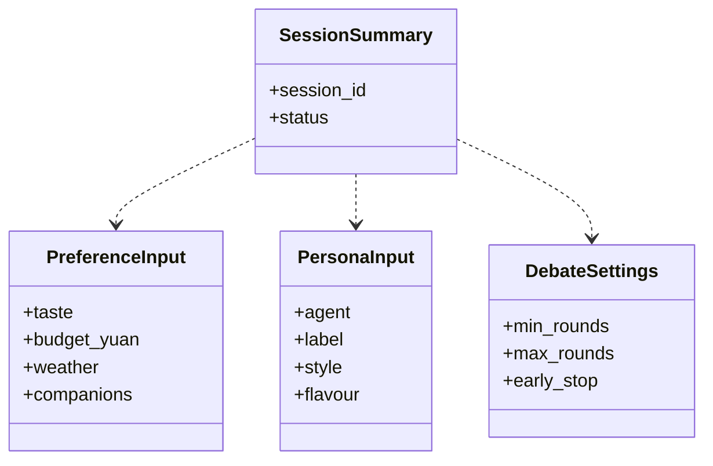
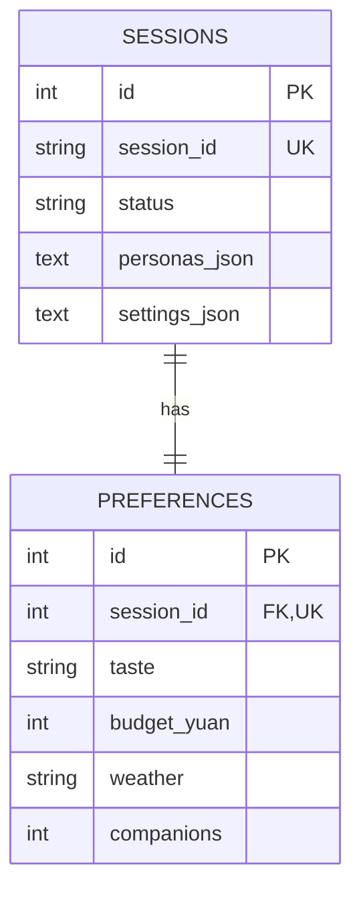
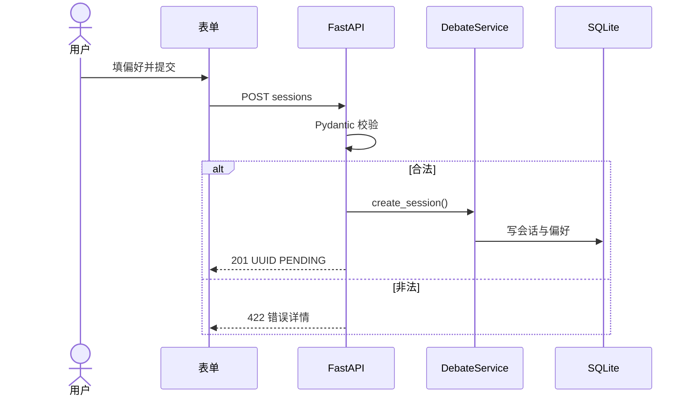
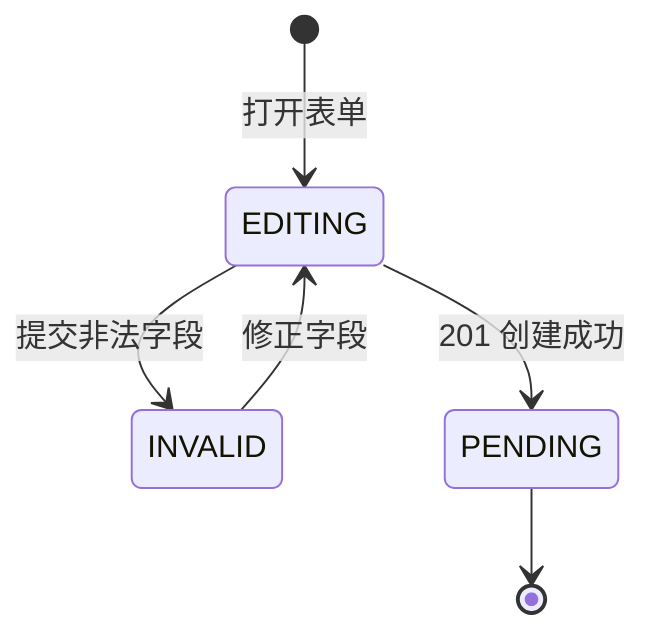

# US01 创建选餐会话

基线：`496eb9d82c`。对应仓库 Issue [#2](https://github.com/wujiade-2005/foodarena-ai/issues/2)，基础自动化场景见 `tests/features/US01_session.feature`。

## 3C：卡片、对话、确认

**Card**：作为校园用户，我希望输入口味、预算、天气和同行人数并创建可追踪会话，以便开始一次与自己约束相关的选餐辩论。

**Conversation**：口味为 1–60 字；预算为 1–200 元整数；同行人数为 1–20；天气取受支持枚举。用户可选填两名大厨人设及 `min_rounds`、`max_rounds`、`early_stop`。系统保存偏好和配置，生成 UUID，初态 `PENDING`；菜单来自运行时目录而非新建会话时写入数据库。无效字段在接口边界返回 422，不建立会话。前端表单还做即时校验，但后端验证是最终依据。

**Confirmation / DoD**：合法输入返回 201 和唯一 `session_id`；随后读取会话能得到 `PENDING`；非法输入 422 且无新增记录；Mock 模式不需要网络或密钥；`pytest tests/features` 与相关 API/契约测试通过。实际是否通过以运行结果为准。

## INVEST 检查

| 项 | 检查 |
| --- | --- |
| I 独立 | 可用 Mock 菜单和测试数据库单独验收，不依赖辩论完成。 |
| N 可协商 | 表单布局、人设输入形式可调整；合法性范围与返回契约受现有代码约束。 |
| V 有价值 | 用户得到可追踪会话，偏好不会在刷新后丢失。 |
| E 可估算 | 输入契约、单个创建接口和两张持久化表，范围明确。 |
| S 小 | 聚焦创建，不含发言与战报。 |
| T 可测试 | HTTP 状态、UUID、数据库记录与无效输入均可自动断言。 |

## Gherkin BDD

```gherkin
# language: zh-CN
功能: 创建选餐会话
  场景: 合法偏好创建会话
    假设 已加载可用菜单且数据库为空
    当 用户提交口味「麻辣」、预算 15 元、天气 rainy、同行 2 人
    那么 接口返回 HTTP 201 与唯一 session_id
    并且 对应会话的初始状态为 PENDING

  场景: 非法偏好不创建会话
    假设 数据库为空
    当 用户提交空口味和 0 元预算
    那么 接口返回 HTTP 422
    并且 数据库中无新增会话
```

仓库已有两项同主题 BDD 场景；上面的措辞补足数据库断言，不能据此断言仓库测试已覆盖全部补充细节。

## 故事级六图

### 图 1 局部用例



### 图 2 局部 DFD



### 图 3 局部领域类图



### 图 4 局部 ER



### 图 5 局部时序



### 图 6 局部状态



**图的边界**：第 6 图是本故事的“表单到会话”局部状态，完整会话生命周期见 `docs/system_design.md`。`INVALID` 是界面表单状态，不是 `SessionStatus` 枚举。
