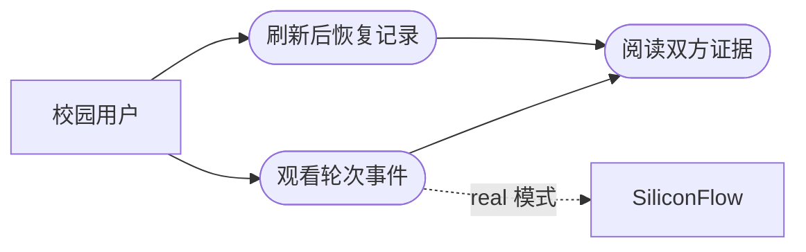
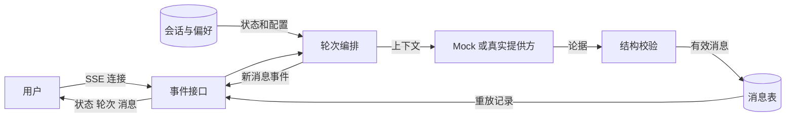
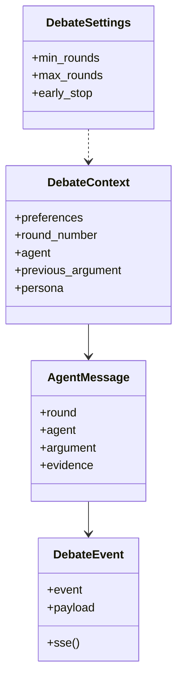
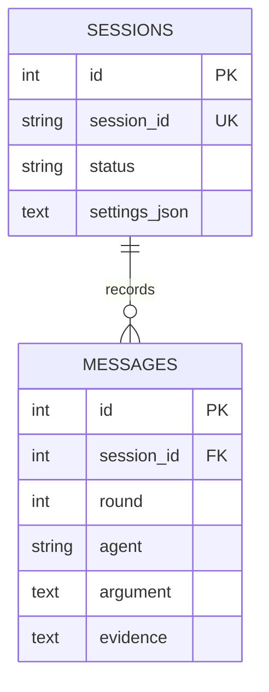
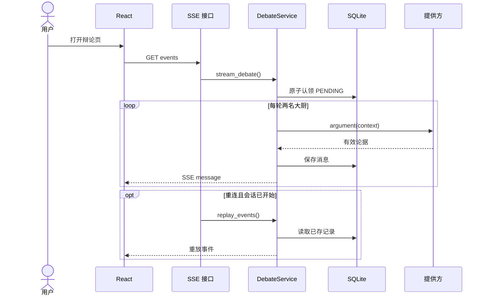
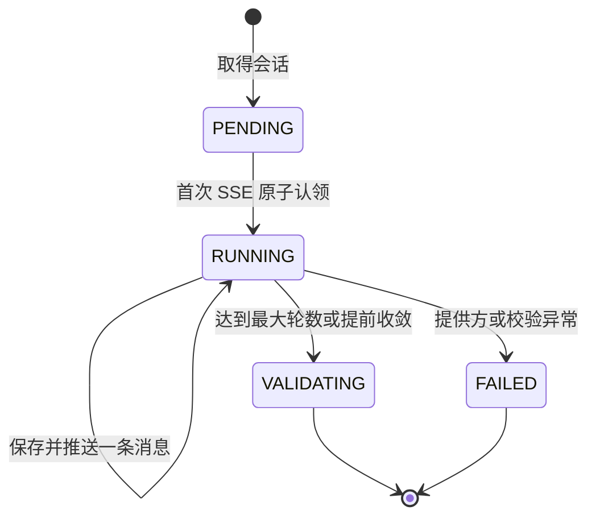

# US02 观看双 Agent 辩论

基线：`496eb9d82c`。关联 Issue [#5](https://github.com/wujiade-2005/foodarena-ai/issues/5)、[#10](https://github.com/wujiade-2005/foodarena-ai/issues/10)、[#15](https://github.com/wujiade-2005/foodarena-ai/issues/15)，基础 BDD 见 `tests/features/US02_debate.feature`。

## 3C：卡片、对话、确认

**Card**：作为校园用户，我希望实时看到两名大厨按轮次交替陈述并能在重连后恢复记录，以便理解推荐形成过程。

**Conversation**：首次对 `PENDING` 会话建立 SSE 可触发辩论；服务端以条件更新原子认领，避免同时连接产生两条链。默认最大三轮、每轮两条；开启提前结束时，在 `min_rounds` 后若双方论点提到同一菜品，可提前进入裁决，因此消息总数为 2–6。每条消息有 `round`、`agent`、`argument`、`evidence`，先落库再推送。重连时重放存储记录；已失败会话只重放 `FAILED`，不重启。前端“重试”目前仅刷新，属于待修复的交互缺陷。

**Confirmation / DoD**：Mock 默认流程产生 3 轮 6 条交替消息；每条满足结构契约；重复启动不增加消息；SSE 分步可见且重连重放；提前结束的分支以独立单测验证；无密钥也可测试。仓库 BDD 只覆盖默认六条和重复启动，其他条件由单元/API 测试或待补验收承接。

## INVEST 检查

| 项 | 检查 |
| --- | --- |
| I 独立 | 以已创建的 `PENDING` fixture 会话验收，可与 US01 的 UI 分开测试。 |
| N 可协商 | 气泡样式、SSE 展示节奏可调整；轮次交替与不重复执行是固定契约。 |
| V 有价值 | 用户可以审视双方论据并在刷新后找回过程。 |
| E 可估算 | 一个轮次控制器、一个事件流接口、持久化及重放。 |
| S 小 | 不包含最终战报渲染；提前结束仅作为本流程条件分支。 |
| T 可测试 | 顺序、条数、字段、重入和重连可由 Mock 精确断言。 |

## Gherkin BDD

```gherkin
# language: zh-CN
功能: 观看双 Agent 辩论
  场景: 默认 Mock 流程交替发言
    假设 已创建 PENDING 会话且使用默认三轮设置
    当 用户连接该会话的 SSE 事件流
    那么 川辣派和粤式养生派交替发言三轮共六条
    并且 每条消息都有轮次、发言者、观点与证据
    并且 会话进入 VALIDATING 或 SUCCESS

  场景: 重连不重复执行
    假设 会话已完成并保存六条消息
    当 用户重新连接 SSE 并再次调用启动接口
    那么 返回已保存的消息与状态
    并且 数据库消息数仍为六条

  场景: 双方收敛后提前结束
    假设 已配置最少两轮且开启提前结束
    当 两名大厨在第二轮提及同一道菜单菜品
    那么 系统记录四条消息并进入裁决
```

前两项与仓库现有 BDD 同主题；第三项是对现有功能的建议验收场景，不标作已在 `.feature` 中执行。

## 故事级六图

### 图 1 局部用例



### 图 2 局部 DFD



### 图 3 局部领域类图



### 图 4 局部 ER



### 图 5 局部时序



### 图 6 局部状态



局部状态图在裁决前结束；完整生命周期见 `docs/system_design.md`。`FAILED` 不存在原地重跑边。
