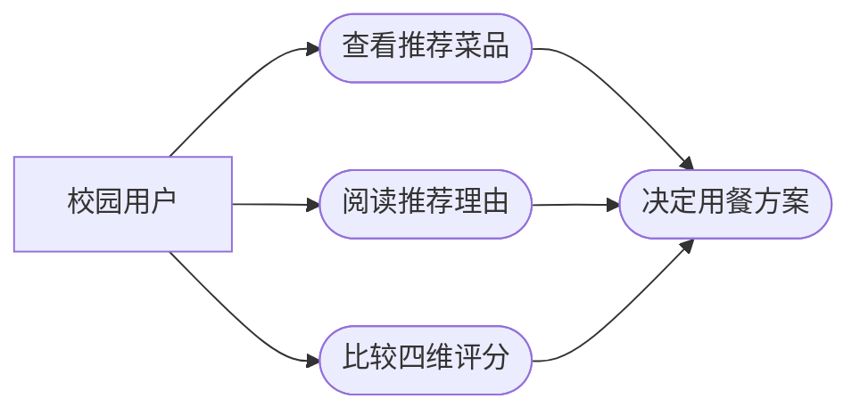
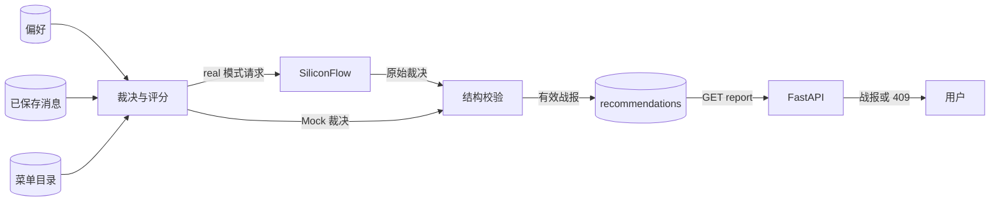
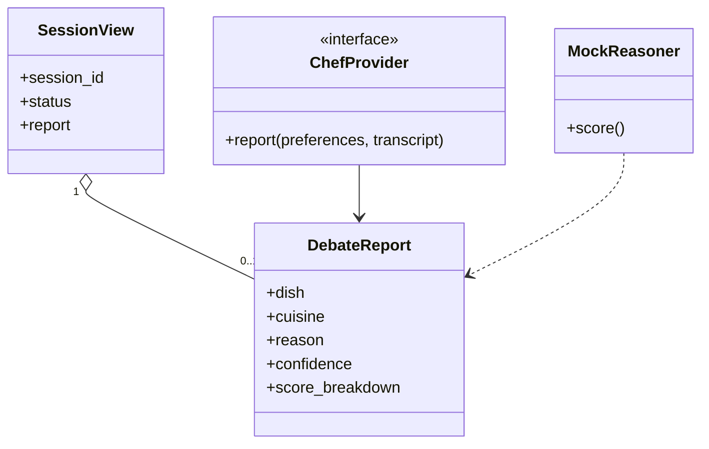
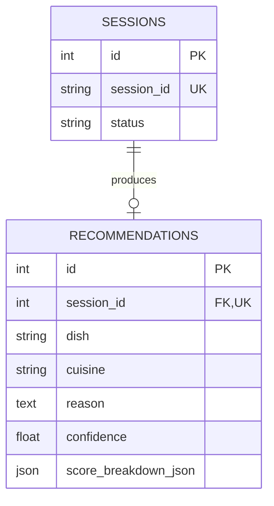
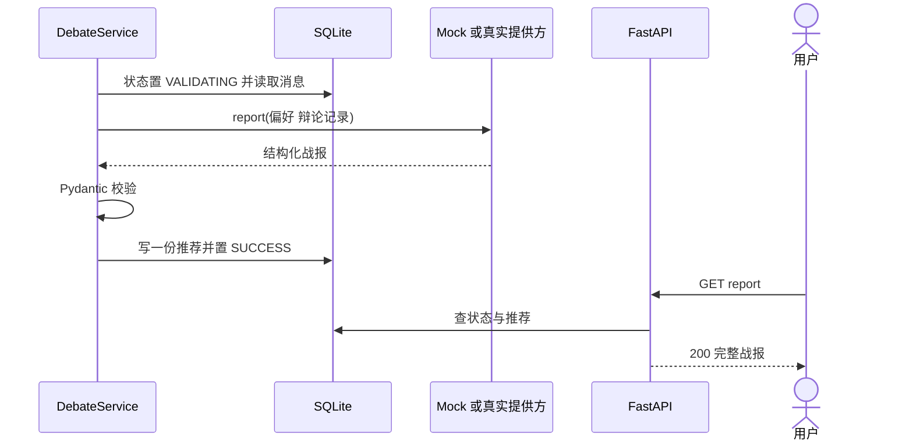
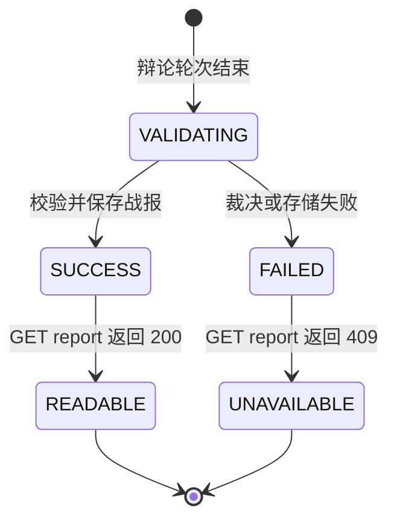

# US03 获取可解释选餐战报

基线：`496eb9d82c`。关联 Issue [#12](https://github.com/wujiade-2005/foodarena-ai/issues/12)，基础 BDD 见 `tests/features/US03_report.feature`。

## 3C：卡片、对话、确认

**Card**：作为校园用户，我希望看到推荐菜品、理由、置信度和四维评分，以便依据可解释的证据决定吃什么。

**Conversation**：辩论结束后服务端进入 `VALIDATING`，以偏好和已保存消息生成战报；外部模型输出需通过 `DebateReport` 等契约检验。战报包含 `dish`、`cuisine`、`reason`、0–1 的 `confidence` 和口味、预算、天气、辩论表现四维评分；成功才写入 `recommendations` 并转为 `SUCCESS`。`GET /report` 对非成功状态返回 409。前端辩论页提供“查看完整战报与评分”按钮，不是自动跳转；`real` 模式可能因网络、额度或格式失败，Mock 可离线演示。

**Confirmation / DoD**：有完整消息且裁决有效时只保存一份战报，字段合法，前端显示各项；`PENDING`、`RUNNING`、`FAILED` 均无伪成功战报；不泄露密钥；相关 BDD/API/契约测试通过。当前评测集以 Mock 评分，不等于真实模型效果评估。

## INVEST 检查

| 项 | 检查 |
| --- | --- |
| I 独立 | 可使用预置辩论记录直接验收裁决和读取，不依赖前端观战 UI。 |
| N 可协商 | 评分展示样式可协商；输出字段、成功门槛和 409 语义固定。 |
| V 有价值 | 用户获得可解释的菜品建议及约束适配依据。 |
| E 可估算 | 单个裁决边界、一张推荐表、一个读取接口和展示组件。 |
| S 小 | 聚焦报告生成与读取，不纳入真实食堂数据更新。 |
| T 可测试 | 字段范围、唯一性、状态码和 Mock 评分均可自动验证。 |

## Gherkin BDD

```gherkin
# language: zh-CN
功能: 读取结构化战报
  场景: 辩论完成后生成并读取战报
    假设 会话已有符合当前轮数设置的完整辩论记录
    当 裁决器生成有效结构化结果
    那么 系统只保存一份推荐并进入 SUCCESS
    并且 战报包含菜品、理由、0 到 1 的置信度
    并且 四维评分包含口味、预算、天气和辩论表现

  场景: 未完成会话不可读取战报
    假设 会话处于 PENDING
    当 用户请求该会话的战报
    那么 接口返回 HTTP 409
    并且 不返回伪造的成功战报
```

仓库已有同主题两项 BDD；“一份推荐”和置信度范围还需结合 ORM 唯一约束及 Pydantic 契约检验。

## 故事级六图

### 图 1 局部用例



### 图 2 局部 DFD



### 图 3 局部领域类图



### 图 4 局部 ER



### 图 5 局部时序



### 图 6 局部状态



`READABLE`、`UNAVAILABLE` 是本故事的可读性状态，不是数据库中的 `SessionStatus` 值。
